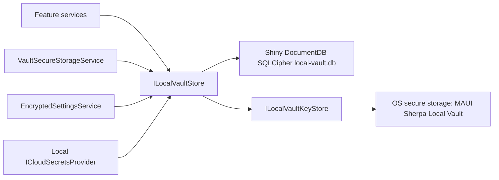

# Secrets storage architecture

MAUI Sherpa stores credentials, signing material, provider configuration, and app-managed secrets. The target architecture is a single SQLCipher-backed local vault for app-owned sensitive data, with OS secure storage used only for the SQLCipher root key.

## Current storage audit

| Area | Code surface | Sensitive data | Current / target storage |
| --- | --- | --- | --- |
| SQLCipher root key | `ILocalVaultKeyStore`, `LocalSecretsKeyStore` | Local vault encryption key | OS secure storage entry `MAUI Sherpa Local Vault`. This is the only long-term OS secure-storage dependency for migrated app-owned data. |
| Central local vault | `ILocalVaultStore`, `SqlCipherLocalVaultStore` | Generic app-owned secrets, metadata, settings, and provider data | Shiny DocumentDB over SQLCipher in `local-vault.db`. Records use a generic scope/path/key envelope. |
| Local secrets provider | `LocalSqlCipherSecretsProvider` | Managed secrets, local copies of synced certs/keystores, publish profile payloads | Built-in provider and logical provider view over the central local vault under `local-provider-secret`. It is always offered as the local default provider. Existing flat keys are preserved in metadata for compatibility. |
| Legacy Local provider DB | first-pass `local-secrets.db` | Local-provider secret values | Lazily migrated into the central vault on Local provider use, then deleted after successful verification/write. |
| Secure-storage compatibility | `VaultSecureStorageService` | Existing app-owned key/value secrets | Reads/writes the central vault under `secure`. On first read, legacy OS/fallback secure-storage values are copied into the vault and removed from the old store. |
| Encrypted settings | `EncryptedSettingsService` | Settings snapshots that may include sensitive config | Vault-backed settings document under `settings`. Existing `settings.enc`, `.bak`, `.unreadable`, and `MauiSherpa_MasterKey` are removed after successful migration. |
| Apple identities | `AppleIdentityService` | P8 private key content | Secret values now flow through vault-backed `ISecureStorageService`; metadata remains in `apple-identities.json` until the identity metadata adapter is migrated. |
| Google identities | `GoogleIdentityService` | Service account JSON/private key | Secret values now flow through vault-backed `ISecureStorageService`; metadata remains in `google-identities.json` until the identity metadata adapter is migrated. |
| Apple Developer download auth | `AppleDownloadAuthService` | Session cookies and Apple ID | Values now flow through vault-backed `ISecureStorageService`. Password is not persisted. |
| Firebase push credentials | `FirebasePushService` | FCM service account JSON/private key | Value now flows through vault-backed `ISecureStorageService`. |
| Android keystores | `KeystoreService`, `KeystoreSyncService` | Keystore password and keystore file | Passwords now flow through vault-backed `ISecureStorageService`; metadata remains in `android-keystores.json` until the keystore metadata adapter is migrated. User-selected keystore files remain at their file paths. |
| Secrets provider config | `CloudSecretsService`, `CloudSecretsProviderFactory` | Client secrets, tokens, service account JSON, vault passwords | Provider metadata and non-secret settings are vault-backed under `cloud-provider`. Secret settings use vault-backed `ISecureStorageService`. Legacy JSON files are removed after migration. |
| Managed remote secrets | `ManagedSecretsService`, `CertificateSyncService`, `KeystoreSyncService`, `PublishProfileService` | User-managed bytes, P12 payloads/passwords, JKS payloads/passwords, publish profiles | Active `ICloudSecretsService` provider. Remote providers keep remote data; Local provider stores in the central vault. |
| Publisher config | `SecretsPublisherService` | GitHub/Gitea/GitLab/Azure DevOps PATs and publisher settings | Existing `secrets_publishers` blob now flows through vault-backed `ISecureStorageService`; a typed publisher metadata adapter can split it later. |
| Push projects | `PushProjectService` | Device tokens, APNs config paths, payloads, send history | Legacy `push-projects.json`; planned vault adapter because operational data can be sensitive. |
| Platform certificate/private-key stores | `LocalCertificateService`, platform APIs | Installed signing identities | Remain in macOS Keychain, Windows certificate store, or Linux user X509 store. The vault stores Sherpa metadata and Local-provider sync copies, not installed platform private-key material. |
| Non-sensitive caches/artifacts | logs, profiling artifacts, Apple root cert cache, downloaded tools, update temp files, Copilot caches, window size/basic UI prefs | Non-secret operational data | Outside the vault unless a future feature makes the data secret-bearing. |

## Local vault model

The central vault is intentionally migration-light. It uses one generic document envelope rather than feature-specific SQL tables:

```csharp
public sealed class LocalVaultItem
{
    public string Id { get; set; } = "";
    public string Scope { get; set; } = "";
    public string Path { get; set; } = "/";
    public string Key { get; set; } = "";
    public string ContentType { get; set; } = "";
    public byte[] Value { get; set; } = [];
    public Dictionary<string, string> Metadata { get; set; } = new();
    public DateTime CreatedAt { get; set; }
    public DateTime UpdatedAt { get; set; }
}
```

`Id` is a deterministic SHA-256 hash of normalized `scope + path + key`, so callers can upsert and retrieve records without a separate index table. `Scope` separates feature domains such as `settings`, `secure`, `cloud-provider`, `local-provider-secret`, and `migration`. `Path` and `Key` provide hierarchy while allowing values to remain JSON, text, or binary.



## First-run Local Vault introduction

The app offers and can select the built-in Local provider before the user answers the Local Vault introduction, but compatibility migrations and vault-backed app settings wait until the user explicitly enables Local Vault. `ILocalVaultIntroductionService` persists the current introduction version and decision in preferences:

- `NotSet`: the current introduction has not been answered. The app shows the introduction on startup, offers Local as the default secrets provider, and keeps non-provider compatibility adapters on legacy storage.
- `Enabled`: the user approved Local Vault. Sherpa may request OS secure-storage access for the root key, create the built-in Local provider, migrate legacy local values into the vault, and make Local the default provider when requested.
- `Declined`: the user chose not to use Local Vault for now. Sherpa does not show the introduction repeatedly, keeps Local visible, and chooses a remote provider as the implicit default if one exists.

While the decision is `NotSet` or `Declined`, compatibility adapters intentionally stay on legacy storage:

- `VaultSecureStorageService` reads and writes the legacy `ILegacySecureStorageService` instead of touching `ILocalVaultStore`.
- `EncryptedSettingsService` reads and writes `settings.enc` instead of opening the vault.
- `CloudSecretsService` stores provider metadata/settings in the legacy JSON files until Local Vault is enabled. It still surfaces Local while the decision is `NotSet` or `Declined`; declined only prevents Local from being preferred over an available remote provider.

The startup flow shows the Local Vault introduction before update prompts, and the modal's enable action calls `ILocalVaultAccessService.RequestAccessAsync()` before marking Local Vault as enabled. If the OS secure-storage prompt is denied or unavailable, Sherpa leaves the decision unset so the user can retry or decline without leaving a half-enabled Local provider.

## Canonical secret paths

New path-aware code should use:

```csharp
public readonly record struct SecretPath(string FolderPath, string Key);
```

Normalization rules:

- Empty or null folder paths normalize to `/`.
- `/` is the logical separator on every platform.
- Folder paths are normalized to leading slash, no trailing slash, and no duplicate separators.
- `.` and `..` path segments are rejected.
- Secret leaf keys cannot be empty or contain path separators.
- Existing flat provider APIs remain supported by encoding a `SecretPath` as `folder/key` and decoding flat keys on the last `/`.

Managed-secret folders are first-class metadata records so the UI can create and select empty folders before any secret exists in them. `ManagedSecretsService` persists those records under `sherpa-secret-folders/` while continuing to infer folders from legacy slash-delimited secret keys for backward compatibility. It also writes a hidden `sherpa-folder-marker` placeholder under the folder's own secret path so providers that only materialize folders when a child secret exists can still represent empty folders. Creating a secret no longer asks the user to type a folder path; the user creates folders with an explicit gesture and chooses an existing folder when adding the secret. Editing a secret can move it to another folder by writing the value and metadata under the new key, then deleting the old key after the new write succeeds. Existing folders can be renamed, which moves managed secrets, child folders, and folder markers under the new path, or deleted when empty.

Recommended mappings for Sherpa-managed keys:

| Legacy key pattern | Canonical path |
| --- | --- |
| `sherpa-secrets/api-key` | path `/managed`, key `api-key` |
| `sherpa-secrets-meta/api-key` | metadata on `/managed/api-key` or companion metadata record |
| `CERT_{serial}_P12` | path `/certificates/{serial}`, key `p12` |
| `CERT_{serial}_PWD` | path `/certificates/{serial}`, key `password` |
| `KEYSTORE_{alias}_JKS` | path `/keystores/{alias}`, key `jks` |
| `KEYSTORE_{alias}_PWD` | path `/keystores/{alias}`, key `password` |
| `sherpa-publish-profiles/{id}` | path `/publish-profiles`, key `{id}` |

Remote provider migrations should rewrite Sherpa-managed legacy keys into canonical paths only after the local vault migration has completed and the provider can verify all rewritten values.

## Per-secret metadata

`ICloudSecretsProvider` supports arbitrary string key/value metadata for each secret through `StoreSecretAsync(..., metadata)`, `GetSecretMetadataAsync`, and `SetSecretMetadataAsync`. `ICloudSecretsService` forwards the same operations to the active provider.

The metadata contract is intentionally exact: metadata keys and values are serialized as one JSON dictionary instead of spreading individual metadata keys into provider-native tag, label, or variable names. That avoids data loss in providers that restrict tag characters, force lower-case labels, or sanitize variable names.

Provider mapping:

| Provider | Metadata storage |
| --- | --- |
| Local | Inline `LocalVaultItem.Metadata` in the SQLCipher vault item. Value updates preserve existing metadata unless replacement metadata is provided. |
| Azure Key Vault, AWS Secrets Manager, Google Secret Manager, Infisical | Reserved companion secret containing the metadata JSON. The companion name is derived from the provider's actual storage key and hidden from `ListSecretsAsync`. |
| 1Password, Vaultwarden / Bitwarden | Reserved companion field on the same secure note/cipher item. The field is hidden from `ListSecretsAsync`. |
| Azure DevOps variable groups | One reserved non-secret companion variable containing the metadata JSON. Legacy per-key `__meta__` variables are still cleaned up on delete. |

`GetSecretMetadataAsync` returns `null` when the primary secret does not exist and an empty dictionary when the secret exists but has no metadata. `SetSecretMetadataAsync` replaces the complete metadata dictionary without changing the secret value; an empty dictionary clears the metadata companion where a companion store is used. Deleting a primary secret also attempts to remove its metadata companion.

Sherpa-managed secrets still keep their typed metadata (`Type`, `Description`, `OriginalFileName`, timestamps, and arbitrary user metadata) in the existing `sherpa-secrets-meta/` JSON record. That remains the source of truth for the managed-secrets UI and avoids creating two independent metadata records for the same Sherpa-managed secret.

## Compatibility adapters

`VaultSecureStorageService` keeps the existing `ISecureStorageService` contract while changing its persistence boundary. Consumers such as Apple identities, Google identities, Firebase push, publisher config, and keystore passwords do not need immediate rewrites; after Local Vault is enabled, their values are stored as vault records in the `secure` scope. Legacy secure-storage values are migrated on first read and deleted from the legacy store after the vault write succeeds. Before Local Vault is enabled, the facade deliberately delegates to legacy secure storage so startup can run without prompting for the vault key.

`EncryptedSettingsService` is also a compatibility facade. After Local Vault is enabled, it reads the vault first, migrates an existing `settings.enc` file when needed, and writes new settings directly to the `settings` scope. After a successful migration, it deletes `settings.enc`, `settings.enc.bak`, `settings.enc.unreadable`, and the old `MauiSherpa_MasterKey`. Before Local Vault is enabled, it keeps using `settings.enc`.

`CloudSecretsService` stores provider metadata and non-secret provider settings in the `cloud-provider` scope after Local Vault is enabled. If legacy `cloud-secrets-providers.json` or `cloud-secrets-{id}.json` files exist, they are imported into the vault and deleted after successful writes. Provider secret settings continue to use `ISecureStorageService`, which maps them to the vault only after the Local Vault introduction has been enabled.

## Export/import impact

The existing `BackupService` continues to export password-protected settings snapshots, but those snapshots now hydrate through services backed by the local vault:

- Settings are read from the `settings` vault scope.
- Provider metadata and non-secret provider settings are read from the `cloud-provider` vault scope through `CloudSecretsService`.
- Provider secret settings, publisher config, identity private keys, Firebase credentials, and keystore passwords are read through vault-backed `ISecureStorageService`.
- Local-provider secrets remain available through `ICloudSecretsService` and can be included by feature-specific export flows without opening a separate database.

A future raw vault package can export selected `scope/path/key` records directly for advanced backup or migration scenarios, but the user-facing backup path does not need a schema-specific database migration to pick up the vault-backed adapters added here.

## Migration and cleanup

Migrations must be explicit, idempotent, and cleanup-aware:

1. Open or create `local-vault.db` with the OS secure-storage root key.
2. Detect a legacy source and acquire a migration lock for that step.
3. Write migrated records into the vault and re-read representative records.
4. Record a migration marker under the `migration` scope.
5. Delete migrated secret-bearing legacy storage only after successful vault writes.
6. Leave legacy storage intact on failure so the migration can be retried.

The implemented Local-provider bridge migrates `local-secrets.db` into `local-vault.db`, preserves each original flat key in metadata, and deletes the old SQLite file and sidecars after successful migration. The secure-storage, encrypted-settings, and secrets-provider configuration adapters follow the same cleanup rule for the data they migrate.

## Guidance for new code

- Store app-owned secret-bearing data through `ILocalVaultStore` or higher-level services backed by it.
- Use `ICloudSecretsService` or `IManagedSecretsService` for values that may sync to Local or remote providers.
- Do not add new feature-specific encrypted files or secure-storage keys for app-owned data.
- Keep OS secure storage limited to root encryption keys or platform tokens that cannot safely move yet.
- Keep installed certificates/private keys in platform stores; put only Sherpa metadata, references, and Local-provider sync copies in the vault.